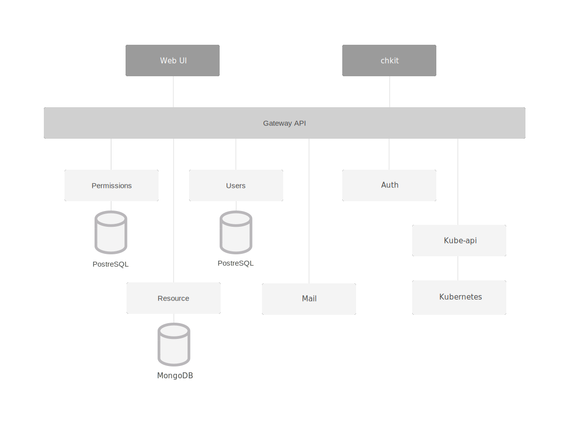

[](https://travis-ci.org/containerum/containerum)


## Overview

Containerum is an open source platform for the complete management of Kubernetes clusters. Containerum features tools for simple CI/CD pipelines setup, revision control, and role management. 

- Runs on top of any Kubernetes cluster
- Managed via CLI or intuitive Web UI


Containerum consists of several components:

* [**api-gateway**](https://github.com/containerum/gateway) provides routing for Containerum components
* [**user-manager**](https://github.com/containerum/user-manager) is a service for managing users, groups, credentials, blacklists for Containerum
* [**resource**](https://github.com/containerum/resource) manages Kubernetes namespace objects: deployments, ingresses, etc.
* [**permissions**](https://github.com/containerum/permissions) manage user access to enable teamwork
* [**kube-api**](https://github.com/containerum/kube-api) is a set of API for communication between Containerum and K8s
* [**auth**](https://github.com/containerum/auth) handles user authorization and token management
* [**mail**](https://github.com/containerum/mail) is a mail server and newsletter template manager
* [**ui**](https://github.com/containerum/ui) is the Web User Interface for Containerum
* [**solutions**](https://github.com/containerum/solutions) is a service for launching pre-built application configurations
* [**volume-manager**](https://github.com/containerum/volume-manager) is storage class manager
* [**nodeMetrics**](https://github.com/containerum/nodeMetrics) is Prometheus-based service for monitoring the node resource utilization
* [**chkit**](https://github.com/containerum/chkit) is CLI for Containerum

and 2 databases:
* MongoDB
* PostgreSQL

Basically, Containerum architecture looks like this:




## Prerequisites
Before installing Containerum make sure you have the following components:

* Docker
* Kubernetes *1.5 or higher*
* Helm
* Installed [Kubernetes Ingress Controller](ingress.md)

*or*

* You can use [Let's Kube](https://github.com/containerum/letskube) utility to install the latest verions of Docker and Kubernetes on your VMs.

## How to install
To launch Containerum on your Kubernetes Cluster run: 

```
helm repo add containerum https://charts.containerum.io
helm repo update
helm install containerum/containerum
```

> Note: To launch deployments in Containerum you need to have an application node. In case you use only one node, make sure it is labeled as slave. To add the label, run:
```
kubectl label node ubuntu-01 role=slave
```
where `ubuntu-01` is the name of your node.


To be able to reach Containerum Web UI and the API, add the machine IP address to /etc/hosts, e.g.:

```
127.0.0.1 local.containerum.io api.local.containerum.io
```
where ```127.0.0.1``` is the address of your machine with Containerum.

Now you can access Containerum Web UI at ```local.containerum.io```. 

Default username: admin@local.containerum.io

Password: verystrongpassword

## Getting started
Containerum has an intuitive web interface and a simple but powerful CLI tool. Yet we recommend learning about the [object types](https://docs.containerum.com/getting-started/object-types/) in Containerum as well as the basics of working with [Containerum Web UI](https://docs.containerum.com/web-panel/) and [chkit CLI](https://docs.containerum.com/cli/) in our Docs.

Don't forget to install [chkit CLI](https://github.com/containerum/chkit) (from source code or binaries - whatever you prefer!).

## Roadmap
To keep track of roadmap implementation, please refer to [Containerum Projects page](https://github.com/containerum/containerum/projects).

- Create scripts to setup CI/CD Pipelines for
	- Jenkins
	- TeamCity
	- Bamboo
	- GitLab
	- Travis
	- Codeship
	- Add pipeline management to chkit
 	- Add pipeline visualization to UI
	
- Add node utilisation charts to the Dashboard

- Create installation scripts for AWS, GCE, MA, DO
	- Create scripts for automated purchase of VMs
	- Create script for managed Kubernetes installation
	- Create an application for backups and recovery
	- Create scripts for updates
	- Add Containerum apps to installation
	
- Add integration with Helm

- Implement ‘Project’ entity
	- Add Projects
	- Add user groups to Projects
	- Add users to Projects
	- Add role management to Projects
	- Add role management to stage environments
	- Add Projects to UI (CRUD)
	- Add recurring checking of completed fields
	- Create Events Server to track events in Projects

- Create Stage environments

- Implement revision control for stage environments
	- Add revision history within a stage
	- Add version change confirmation in production
	- Add revision control
	- Add automated rollbacks
	- Implement rollback mechanism
	- Implement update of changed files only

- Implement revision control for Projects

- Add Solutions and Marketplace

- Add admin control features


## Contributing
We welcome any help from the open source community. To submit your contributions, fork the project you want to contribute to (e.g. *permissions, auth, etc.*), commit changes and create a pull request to the develop branch. We will review the changes and include them to the project. Read more about contributing [in this document.](https://github.com/containerum/containerum/blob/master/CONTRIBUTING.md)

## Issues and Support
Please submit any comments and report Containerum project bugs or issues in this repository.
In case you have questions about Containerum, there are several ways you can reach out to our team: by filling out the form on our [support page](https://containerum.com/support/) or by email at support@containerum.io.

## Docs
You can find the Documentation and Quick Start tutorial for Containerum in the [Docs section](https://docs.containerum.com/) on our website or in the [Docs repository](https://github.com/containerum/containerum-docs) here on GutHub. Please, feel free to contribute to the Docs to help us make them more accurate and comprehensive.

## Online version
Containerum platform is also available online at containerum.com/online. It is already installed and preconfigured for production. While the platform is still free, users are billed only for resources.

## License
Copyright (c) 2015-2018 Exon LV.

Licensed under the Apache License, Version 2.0 (the "License"); you may not use this file except in compliance with the License. You may obtain a copy of the License at http://www.apache.org/licenses/LICENSE-2.0

Unless required by applicable law or agreed to in writing, software distributed under the License is distributed on an "AS IS" BASIS, WITHOUT WARRANTIES OR CONDITIONS OF ANY KIND, either express or implied. See the License for the specific language governing permissions and limitations under the License.
