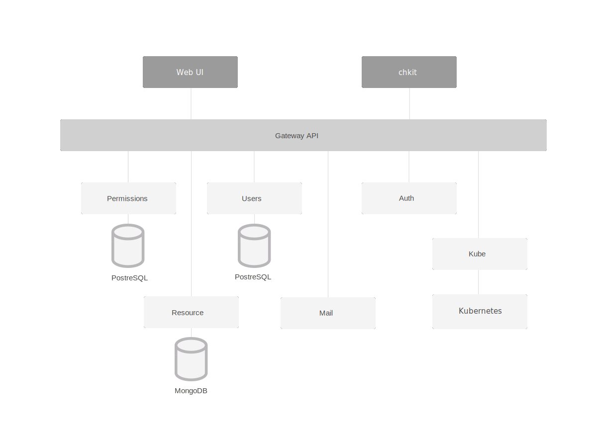

## Overview

Containerum is open source package manager and UI for Kubernetes. Containerum is built to aid cluster management, teamwork and resource allocation. Containerum runs on top of any Kubernetes cluster and provides a friendly Web UI for cluster management. 

Containerum consists of several components:

* **api-gateway** provides routing for Containerum components
* **user-manager** is a service for managing users, groups, credentials, blacklists for Containerum
* **resource** manages Kubernetes namespace objects: deployments, ingresses, etc.
* **permissions** manage user access to enable teamwork
* **kube** is a set of API for communication between Containerum and K8s
* **auth** handles user authorization and token management
* **mail** is a mail client and newsletter template manager
* **ui** is Web User Interface for Containerum
* **chkit** is CLI for Containerum 

and 2 databases:
* MongoDB
* PostgreSQL

Basically, Containerum architecture looks like this:




## Prerequisites
Before installing Containerum make sure you have the following components:

* Docker
* Kubernetes *1.5 or higher*
* Helm

*or*

* You can use [Let's Kube](https://github.com/containerum/letskube) utility to install the latest verions of Docker and Kubernetes on your VMs.

## How to install (Quick start)
To launch Containerum on your VMs run 

``` 
helm repo add https://charts.containerum.io
helm repo update
helm install containerum/containerum
```

## Roadmap

1) Create scripts to setup CI/CD Pipelines for
	- Jenkins
	- TeamCity
	- Bamboo
	- GitLab
	- Travis
	- Codeship
	- Add pipeline management to chkit
 	- Add pipeline visualization to UI

2) Create installation scripts for AWS, GCE, MA, DO
	- Create scripts for automated purchase of VMs
	- Create script for managed Kubernetes installation 
	- Create an application for backups and recovery
	- Create scripts for updates
	- Add Containerum apps to installation

3) Implement ‘Project’ entity
	- Add Projects
	- Add user groups to Projects
	- Add users to Projects
	- Add role management to Projects
	- Add role management to stage environments
	- Add Projects to UI (CRUD)
	- Add recurring checking of completed fields
	- Create Events Server to track events in Projects

4) Create Stage environments

5) Implement revision control for stage environments
	- Add revision history within a stage
	- Add version change confirmation in production
	- Add revision control
	- Add automated rollbacks
	- Implement rollback mechanism
	- Implement update of changed files only

6) Implement revision control for Projects

7) Add Solutions and Marketplace

8) Add admin control features

## Contributing
We welcome any help from the open source community. To submit your contributions, fork the project you want to contribute to (e.g. *permissions, auth, etc.*), commit changes and create a pull request. We will review the changes and include them to the project. 

## Issues and Support
Please submit any comments and report Containerum project bugs or issues in this repository.
In case you have questions about Containerum, there are several ways you can reach out to our team: by filling out the form on our [support page](https://containerum.com/support/) or by email at support@containerum.io.

## Docs
You can find the Documentation and Quick Start tutorial for Containerum in the [Docs section](https://docs.containerum.com/docs/about/) on our website or in the [Docs repository](https://github.com/containerum/docs) here on GutHub. Please, feel free to contribute to the Docs to help us make them more accurate and comprehensive.

## License
Copyright (c) 2015-2018 Exon LV.

Licensed under the Apache License, Version 2.0 (the "License"); you may not use this file except in compliance with the License. You may obtain a copy of the License at http://www.apache.org/licenses/LICENSE-2.0

Unless required by applicable law or agreed to in writing, software distributed under the License is distributed on an "AS IS" BASIS, WITHOUT WARRANTIES OR CONDITIONS OF ANY KIND, either express or implied. See the License for the specific language governing permissions and limitations under the License.
